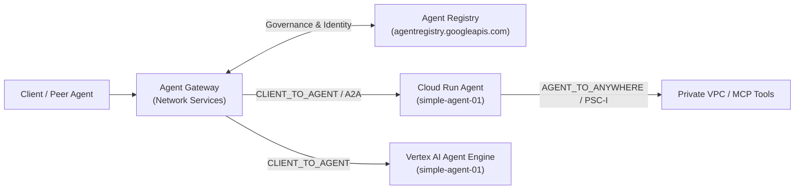

# Simple Agent 01 (`network_agent`) — Google Cloud Agent Platform & Agent Gateway Lab

A beginner-friendly AI Agent built with the **Google Agent Development Kit (ADK)** for studying **Agent Registry** and **Network Services Agent Gateway** on Google Cloud (`gcp-demo-02-307713`).

---

## 1. Live Deployed Endpoints (`gcp-demo-02-307713`)

| Runtime Target | Region | Live Endpoint / Playground URL | Agent Registry Resource Name |
| :--- | :--- | :--- | :--- |
| **Cloud Run (Web UI + API + A2A)** | `asia-southeast2` | `https://simple-agent-01-66063681189.asia-southeast2.run.app` | `projects/gcp-demo-02-307713/locations/asia-southeast2/services/simple-agent-01-cloudrun` |
| **Cloud Run (Web UI + API + A2A)** | `us-central1` | `https://simple-agent-01-66063681189.us-central1.run.app` | `projects/gcp-demo-02-307713/locations/us-central1/agents/agentregistry-00000000-0000-0000-1459-bfd23a25490d` |
| **Vertex AI Agent Engine** | `asia-southeast2` | [Console Playground (`7211353718954917888`)](https://console.cloud.google.com/vertex-ai/agents/agent-engines/locations/asia-southeast2/agent-engines/7211353718954917888/playground?project=66063681189) | `projects/gcp-demo-02-307713/locations/asia-southeast2/agents/agentregistry-00000000-0000-0000-ba83-6207b1257716` |
| **Vertex AI Agent Engine** | `us-central1` | [Console Playground (`9059214401072005120`)](https://console.cloud.google.com/vertex-ai/agents/agent-engines/locations/us-central1/agent-engines/9059214401072005120/playground?project=66063681189) | `projects/gcp-demo-02-307713/locations/us-central1/agents/agentregistry-00000000-0000-0000-b23e-d0756d17eda0` |

---

## 2. Zero-Coding Anatomy of an Agent

An ADK Agent requires only **3 files** inside the [`network_agent/`](./network_agent/) folder:

| File | Purpose |
| :--- | :--- |
| [`network_agent/__init__.py`](./network_agent/__init__.py) | Tells Python that `network_agent` is an Agent package (`from . import agent`). |
| [`network_agent/agent.py`](./network_agent/agent.py) | Defines `root_agent` (the Gemini model, instructions, and Python function tools). |
| [`network_agent/requirements.txt`](./network_agent/requirements.txt) | Lists the required Python libraries (`google-adk[a2a]` and `google-cloud-aiplatform[agent_engines]`). |

### How `agent.py` Works
1. **Tools (Functions):** Normal Python functions (`check_gcp_subnet_ips` and `recommend_agent_gateway_mode`). Gemini reads the function description (docstring) and automatically decides when to call them.
2. **The Agent (`root_agent`):** Connects the **Model** (`gemini-2.5-flash`), **Instructions** (system prompt), and **Tools** list.

---

## 3. Deploying the Agent (Cloud Run vs. Vertex AI Agent Engine)

### Option A: Deploy to Cloud Run (with Web UI + A2A Protocol)
Deploys the agent as a serverless container with both an interactive **ADK Web UI** and an **Agent-to-Agent (`--a2a`)** endpoint:
```bash
adk deploy cloud_run \
  --project=gcp-demo-02-307713 \
  --region=asia-southeast2 \
  --service_name=simple-agent-01 \
  --with_ui \
  --a2a \
  ./network_agent \
  -- --allow-unauthenticated

gcloud run services update simple-agent-01 \
  --region=asia-southeast2 \
  --project=gcp-demo-02-307713 \
  --update-env-vars="GOOGLE_GENAI_USE_VERTEXAI=TRUE,GOOGLE_CLOUD_PROJECT=gcp-demo-02-307713,GOOGLE_CLOUD_LOCATION=us-central1"
```

### Option B: Deploy to Vertex AI Agent Engine
Deploys the agent into Google Cloud's managed **Vertex AI Agent Platform** runtime (`ReasoningEngine`), which **auto-registers** into `agentregistry.googleapis.com`:
```bash
adk deploy agent_engine \
  --project=gcp-demo-02-307713 \
  --region=asia-southeast2 \
  --display_name="simple-agent-01" \
  --description="Google Cloud Networking & Agent Gateway Assistant" \
  ./network_agent
```

---

## 4. How Agent Platform, Agent Registry, and Agent Gateway Fit Together (Networking View)



### Useful `gcloud` Commands for Studying Agent Gateway

1. **List Agents & MCP Servers in Agent Registry:**
   ```bash
   gcloud alpha agent-registry agents list --location=asia-southeast2 --project=gcp-demo-02-307713
   gcloud alpha agent-registry agents list --location=us-central1 --project=gcp-demo-02-307713
   ```
2. **Inspect Your Existing Network Services Agent Gateway (`us-central1`):**
   ```bash
   gcloud network-services agent-gateways list --location=us-central1 --project=gcp-demo-02-307713
   gcloud network-services agent-gateways describe agent-gateway --location=us-central1 --project=gcp-demo-02-307713
   ```
