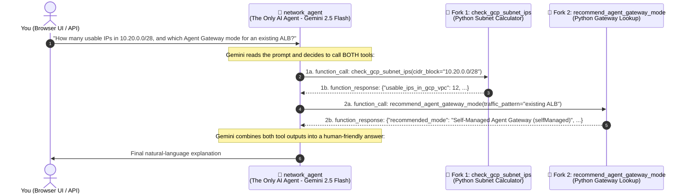
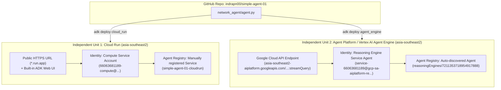
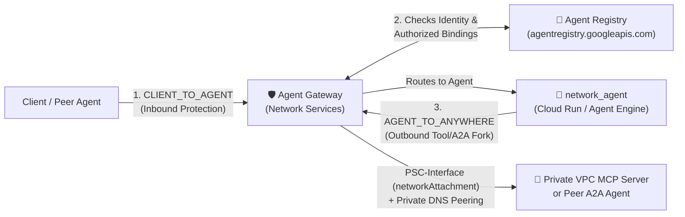

# Google Cloud Agent Platform & Agent Gateway — Study Notes (`simple-agent-01`)

> **Author / Context:** Study notes for a Google Cloud CE Networking Specialist learning how AI Agents are built, deployed, discovered in **Agent Registry**, and governed by **Network Services Agent Gateway**—starting from zero coding experience.

---

## 1. Anatomy of an AI Agent (Zero-Coding Mental Model)

### 1.1 The 3 Files That Make Up an ADK Agent
Using the **Google Agent Development Kit (ADK)**, an agent requires only three files inside [`network_agent/`](./network_agent/):

1. **[`network_agent/__init__.py`](./network_agent/__init__.py)**
   - Contains a single line: `from . import agent`
   - Tells Python that the `network_agent` directory is an importable Agent package.
2. **[`network_agent/agent.py`](./network_agent/agent.py)**
   - Defines the **Agent (`root_agent`)** and its **Tools (Python functions)**.
3. **[`network_agent/requirements.txt`](./network_agent/requirements.txt)**
   - Lists the software packages needed in the container (`google-adk[a2a]` and `google-cloud-aiplatform[agent_engines]`).

---

### 1.2 Understanding the Visual Graph: "1 Main Agent + 2 Forks"
When you open the ADK Web UI or Vertex AI Playground graph, you see **`network_agent`** branching out into two forks:
- `🔧 check_gcp_subnet_ips`
- `🔧 recommend_agent_gateway_mode`

#### Key Concept: Are these 3 different Agents?
**No!** There is only **1 single AI Agent (`network_agent`)**. The 2 forks are **Tools (Python functions)** inside that single agent's toolbox.

| Component in Graph | What It Actually Is | Networking Analogy | Has AI / LLM? |
| :--- | :--- | :--- | :--- |
| **`network_agent` (`root_agent`)** | **The AI Agent (Gemini 2.5 Flash)** | **The Network Engineer (Brain):** Reads user questions, decides which tool to run, and writes the final response. | **Yes** (`gemini-2.5-flash`) |
| **Fork 1: `check_gcp_subnet_ips`** | **A Python Function Tool** | **`ipcalc` CLI utility:** Takes a CIDR string (`10.20.0.0/28`), computes usable GCP IPs (`16 - 4 = 12`), and returns raw JSON. | **No** (100% deterministic Python math) |
| **Fork 2: `recommend_agent_gateway_mode`** | **A Python Function Tool** | **Routing lookup table (`if/else`):** Checks keywords (`ALB`, `SWP`, `MCP`, `egress`) and returns the matching Agent Gateway deployment mode. | **No** (100% deterministic lookup) |

```python
# How this maps directly to lines 84-95 of network_agent/agent.py:
root_agent = Agent(
    model="gemini-2.5-flash",
    name="network_agent",                         # <-- The 1 Main Agent (Brain)
    description="...",
    instruction="...",
    tools=[                                       # <-- The 2 Forks (Tools)
        check_gcp_subnet_ips,                     #     Fork 1
        recommend_agent_gateway_mode,             #     Fork 2
    ],
)
```

---

### 1.3 Step-by-Step Packet / Execution Flow When You Ask a Question



- If you ask a general greeting (*"Hello, who are you?"*), `network_agent` answers directly **without calling either fork**.
- If you ask about a CIDR block, `network_agent` calls **Fork 1 (`check_gcp_subnet_ips`)**.
- If you ask about Agent Gateway architecture, `network_agent` calls **Fork 2 (`recommend_agent_gateway_mode`)**.

---

## 2. Cloud Run vs. Agent Platform (Vertex AI Agent Engine)

### 2.1 One Unit or Two Independent Units?
They operate as **two completely separate, 100% independent units** in `asia-southeast2`:
- Both were built from the same local code ([`network_agent/agent.py`](./network_agent/agent.py)).
- They do **not** communicate with each other or share state. Stopping or deleting Cloud Run has zero impact on Agent Platform (Vertex AI Agent Engine), and vice versa.



### 2.2 Detailed Comparison Table

| Feature | Unit 1: Cloud Run (`simple-agent-01`) | Unit 2: Agent Platform / Vertex AI Agent Engine (`7211353718954917888`) |
| :--- | :--- | :--- |
| **Deployment Command** | `adk deploy cloud_run` | `adk deploy agent_engine` |
| **Compute Model** | Serverless container in **your GCP project** running a FastAPI server (`adk api_server --with_ui --a2a`). | Google-managed **AI Agent PaaS** running in a Google tenant project behind `aiplatform.googleapis.com`. |
| **Why does Cloud Run give a direct Web URL while Agent Platform does not?** | Because `--with_ui` bundles the ADK developer web interface inside the container on port `8080` and exposes `*.run.app`. | Agent Engine is a **backend API runtime**, not a public website host. All access is governed by Google Cloud IAM (`roles/aiplatform.user`) through `aiplatform.googleapis.com`. |
| **Session & Memory** | In-memory (`memory://`) inside the container by default (resets when container scales down). | **Managed Session & Memory services** persisted automatically by Vertex AI. |
| **Runtime Identity** | Your project's Compute Engine Service Account (`66063681189-compute@developer.gserviceaccount.com`). | Google-managed Reasoning Engine Service Agent (`sa://service-66063681189@gcp-sa-aiplatform-re.iam.gserviceaccount.com`). |
| **How it Appears in Agent Registry (`agentregistry.googleapis.com`)** | Must be **manually registered** using `gcloud alpha agent-registry services create`. | **Automatically discovered** and registered by Google Cloud as soon as the `ReasoningEngine` is deployed. |

---

## 3. How to Access & Test Your Deployed Agents (`asia-southeast2`)

### 3.1 Accessing Unit 1: Cloud Run (`asia-southeast2`)
- **Browser UI (ADK Web UI):**
  **[https://simple-agent-01-66063681189.asia-southeast2.run.app](https://simple-agent-01-66063681189.asia-southeast2.run.app)**
- **REST API (`curl`):**
  ```bash
  # 1. Create a session
  curl -s -X POST "https://simple-agent-01-66063681189.asia-southeast2.run.app/apps/network_agent/users/indra/sessions/s1" \
    -H "Content-Type: application/json" -d '{}'

  # 2. Send a message
  curl -s -X POST "https://simple-agent-01-66063681189.asia-southeast2.run.app/run" \
    -H "Content-Type: application/json" \
    -d '{
      "app_name": "network_agent",
      "user_id": "indra",
      "session_id": "s1",
      "new_message": {
        "role": "user",
        "parts": [{"text": "How many usable IPs are in 10.10.0.0/28 in GCP?"}]
      }
    }'
  ```

---

### 3.2 Accessing Unit 2: Agent Platform / Vertex AI Agent Engine (`asia-southeast2`)
Because Agent Platform sits behind the Google Cloud `aiplatform.googleapis.com` API control plane, you access it in 3 ways:

1. **Google Cloud Console Playground (Zero-Code Browser UI):**
   **[Open Vertex AI Agent Engine Playground (`7211353718954917888`)](https://console.cloud.google.com/vertex-ai/agents/agent-engines/locations/asia-southeast2/agent-engines/7211353718954917888/playground?project=gcp-demo-02-307713)**
   *(Navigation in Console: **Vertex AI** $\rightarrow$ **Agent Engine** $\rightarrow$ Region: **`asia-southeast2`** $\rightarrow$ **`simple-agent-01`** $\rightarrow$ **Playground** tab).*

2. **Direct REST API (`curl` with IAM Bearer Token):**
   ```bash
   curl -s -X POST \
     -H "Authorization: Bearer $(gcloud auth application-default print-access-token)" \
     -H "Content-Type: application/json" \
     "https://asia-southeast2-aiplatform.googleapis.com/v1/projects/66063681189/locations/asia-southeast2/reasoningEngines/7211353718954917888:streamQuery" \
     -d '{
       "class_method": "async_stream_query",
       "input": {
         "user_id": "indra",
         "message": "My agent needs outbound egress to call an internal MCP server in my private VPC. Which Agent Gateway mode should I use?"
       }
     }'
   ```

3. **Enterprise End-User UI (Gemini Enterprise / Agentspace) or Agent Gateway:**
   In production, customers link the Reasoning Engine ID (`7211353718954917888`) into **Gemini Enterprise (Agentspace)** or expose it behind **Agent Gateway**.

---

### 3.3 How to Verify `recommend_agent_gateway_mode` is Called

Paste any of these 3 prompts into either the Cloud Run Web UI or the Vertex AI Playground:

| Test Case | Prompt to Paste | Tool Branch Triggered |
| :--- | :--- | :--- |
| **1. Outbound Egress to Private VPC / MCP** | `"My agent needs outbound egress to call an internal MCP server in my private VPC. Which Agent Gateway mode should I use?"` | Returns **`Google-Managed Agent Gateway (googleManaged: AGENT_TO_ANYWHERE)`** with PSC-Interface (`networkAttachment`) + DNS Peering |
| **2. Attach to Existing ALB or SWP** | `"We already have an Application Load Balancer (ALB) and Secure Web Proxy. Which Agent Gateway mode should we use?"` | Returns **`Self-Managed Agent Gateway (selfManaged)`** attached via Service Extensions |
| **3. Protect Inbound Client-to-Agent Traffic** | `"How should I deploy Agent Gateway to protect inbound client to agent connections?"` | Returns **`Google-Managed Agent Gateway (googleManaged: CLIENT_TO_AGENT)`** with Managed mTLS Endpoint |

**How to confirm the tool ran:**
- **In the UI:** Look for the **`⚡ recommend_agent_gateway_mode`** chip right above the agent's reply. Click it (or open the **Trace / Events** panel) to inspect the `functionCall` arguments and `functionResponse` JSON.
- **In `curl` output:** You will see three JSON events in sequence:
  1. `"function_call": {"name": "recommend_agent_gateway_mode", "args": {...}}`
  2. `"function_response": {"name": "recommend_agent_gateway_mode", "response": {...}}`
  3. `"text": "For your agent's outbound egress..."`

---

## 4. Connecting the Dots to **Agent Registry** & **Agent Gateway** (Networking View)

### 4.1 Why Do We Need Agent Gateway?
In our `simple-agent-01`, the 2 tool forks (`check_gcp_subnet_ips` and `recommend_agent_gateway_mode`) are **local Python functions** running inside the **same container**. No network packets leave the container when `network_agent` calls them.

However, in real enterprise deployments:
- **Fork 1** becomes a **Remote MCP Server** (e.g., an internal database, CRM, or NetBox IPAM tool hosted inside a private VPC).
- **Fork 2** becomes a **Remote Peer Agent (A2A)** (e.g., a SecOps Agent or Billing Agent hosted in another project/VPC).

As soon as those forks cross the network, **traditional L3/L4 firewalls and standard L7 load balancers are not enough** because they only see IP addresses or raw HTTP POST paths (`/run` or `/mcp`)—they don't know **which Agent Identity** is calling **which MCP Tool** or whether that specific agent-to-tool binding is authorized in **Agent Registry**.



### 4.2 The Two Operating Modes of Agent Gateway (`gcloud network-services agent-gateways`)

1. **Google-Managed Mode (`googleManaged`)**
   - Google orchestrates and manages the proxy in a Google tenant project (`mtlsEndpoint` + Root Certificates).
   - Supports two governed access paths:
     - **`CLIENT_TO_AGENT`**: Protects inbound traffic arriving at your Agent or Tool.
     - **`AGENT_TO_ANYWHERE`**: Governs outbound connections from your Agent (such as Vertex AI Agent Engine) to private VPC destinations/MCP servers using a **PSC-Interface (`networkAttachment`)** and **DNS Peering (`dnsPeeringConfig`)**.
2. **Self-Managed Mode (`selfManaged`)**
   - Attaches Agent Gateway governance (via **Service Extensions**) directly onto your existing **Application Load Balancer (ALB)** or **Secure Web Proxy (SWP)** resource URI (`resourceUri`).

---

### 4.3 Essential `gcloud` Cheat Sheet for Your Lab

```bash
# 1. List all discovered & registered Agents in Agent Registry (asia-southeast2)
gcloud alpha agent-registry agents list \
  --location=asia-southeast2 \
  --project=gcp-demo-02-307713

# 2. List manually registered Services (like our Cloud Run service) in Agent Registry
gcloud alpha agent-registry services list \
  --location=asia-southeast2 \
  --project=gcp-demo-02-307713

# 3. List MCP Servers registered in Agent Registry
gcloud alpha agent-registry mcp-servers list \
  --location=asia-southeast2 \
  --project=gcp-demo-02-307713

# 4. List Auth/Traffic Bindings in Agent Registry
gcloud alpha agent-registry bindings list \
  --location=asia-southeast2 \
  --project=gcp-demo-02-307713

# 5. List & Describe Network Services Agent Gateways
gcloud network-services agent-gateways list \
  --location=us-central1 \
  --project=gcp-demo-02-307713

gcloud network-services agent-gateways describe agent-gateway \
  --location=us-central1 \
  --project=gcp-demo-02-307713
```
